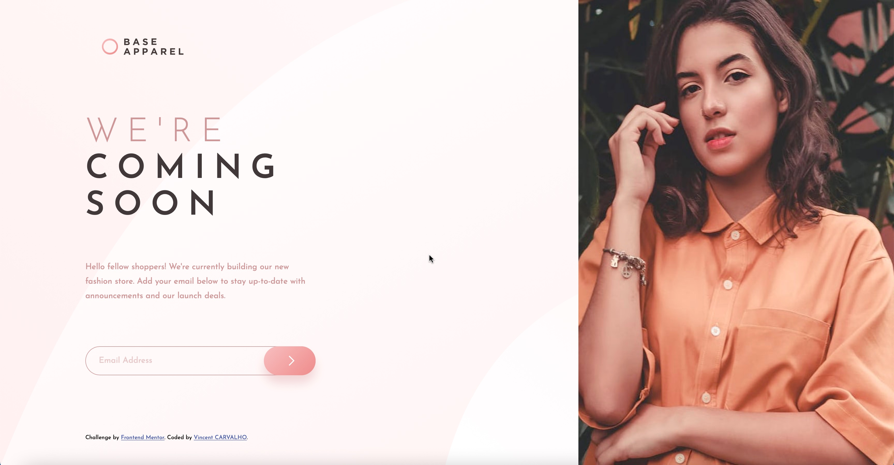

# Frontend Mentor - Base Apparel coming soon page solution

This is a solution to the [Base Apparel coming soon page challenge on Frontend Mentor](https://www.frontendmentor.io/challenges/base-apparel-coming-soon-page-5d46b47f8db8a7063f9331a0). Frontend Mentor challenges help you improve your coding skills by building realistic projects. 

## Table of contents

- [Overview](#overview)
  - [The challenge](#the-challenge)
  - [Screenshot](#screenshot)
  - [Links](#links)
- [My process](#my-process)
  - [Built with](#built-with)
  - [What I learned](#what-i-learned)
  - [Useful resources](#useful-resources)
- [Author](#author)

## Overview

### The challenge

Users should be able to:

- View the optimal layout for the site depending on their device's screen size
- See hover states for all interactive elements on the page
- Receive an error message when the `form` is submitted if:
  - The `input` field is empty
  - The email address is not formatted correctly

### Screenshot

### Links

- Solution URL: [https://github.com/CarvalhoVincent/Base-apparel-comming-soon]
- Live Site URL: [https://carvalhovincent.github.io/Base-apparel-comming-soon/]

## My process

### Built with

- Semantic HTML5 markup
- Flexbox
- CSS Grid
- Mobile-first workflow

### What I learned

I learned some little things, how to place elements better , how to manage images.
This challenge was a good reminder for some skills, I wanted a small one this time.

### Useful resources

- [https://www.w3schools.com] - Used it for some reminders about CSS and JS.

## Author

- Frontend Mentor - [@CarvalhoVincent](https://www.frontendmentor.io/profile/CarvalhoVincent)

